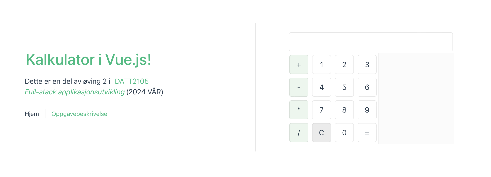
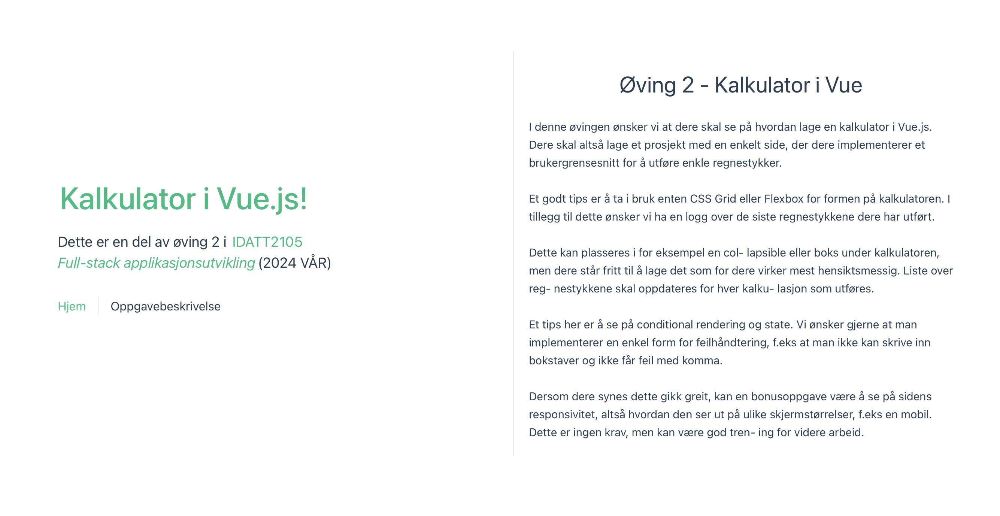
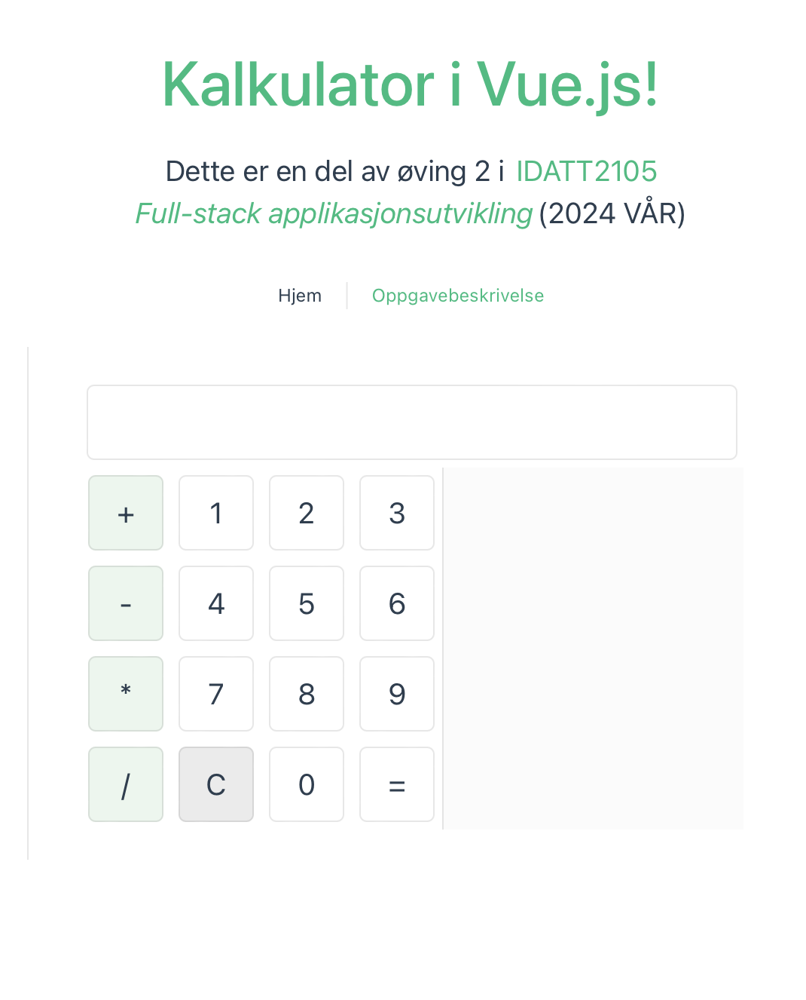

# Kalkulator i Vue.js
###  Del av emnet IDATT2105 - Full-stack applikasjonsutvikling
Funksjonalitet:
- Unntakshåndtering ved ugyldige operasjoner (divisjon med 0)
- Navigasjon med tastatur
- Historikk over tidligere svar

Skjermbilder:

